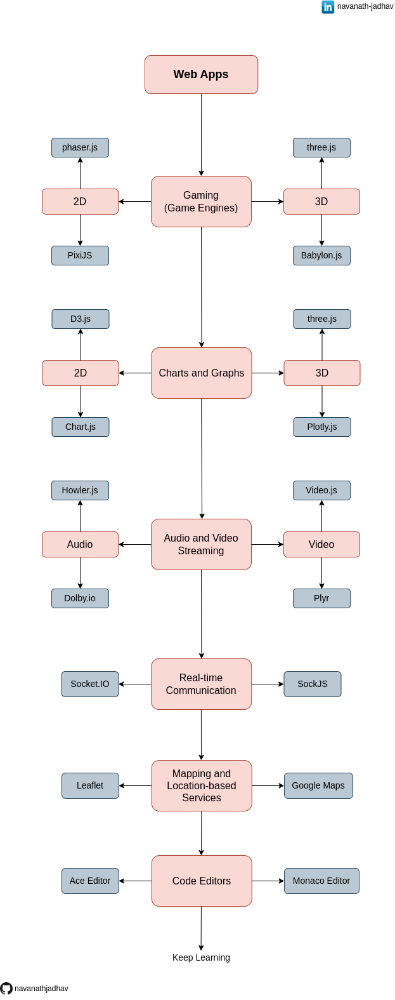

# Advanced-JavaScript-Libraries [React+Angular]

This roadmap features some of the best JavaScript libraries for different categories of web applications, including gaming, charts and graphs, audio and video streaming, real-time communication, mapping and location-based services, and code editors. All of the libraries listed here work seamlessly with React and Angular frameworks, providing advanced features and functionality for web applications.

## Give a Star ⭐

If you liked this project or found it helpful then please give it a star.
Thanks.

## Roadmap

## Download

Get a [PDF version](./Advanced-JavaScript-Libraries.pdf).

## Gaming

If you are building a gaming application, you might consider using Phaser.js or PixiJS for 2D games, or Three.js or Babylon.js for 3D games. These libraries provide a wide range of features and tools for game development, including animation, physics, and input handling.

1.  2D

    - [Phaser.js](https://github.com/photonstorm/phaser)
    - [PixiJS](https://github.com/pixijs/pixi.js)

2.  3D
    - [Three.js](https://github.com/mrdoob/three.js/)
    - [Babylon.js](https://github.com/BabylonJS/Babylon.js/)

## Charts and Graphs

For data visualization and charting, you might consider using D3.js or Chart.js for 2D data visualizations, or Three.js or Plotly.js for 3D charts and graphs. These libraries provide powerful features for rendering and manipulating data, including interactivity and animations.

1.  2D
    - [D3.js](https://github.com/d3/d3)
    - [Chart.js](https://github.com/chartjs/Chart.js)
2.  3D
    - [Three.js](https://github.com/mrdoob/three.js/)
    - [Plotly.js](https://github.com/plotly/plotly.js/)

## Audio and Video Streaming

For audio and video streaming, Howler.js and Dolby.io are both excellent choices for audio, while Video.js and Plyr are ideal for video. These libraries provide advanced features for streaming and playing media, including cross-browser compatibility and customization options.

1.  Audio
    - [Howler.js](https://github.com/goldfire/howler.js)
    - [Dolby.io](https://dolby.io)
2.  Video:
    - [Video.js](https://github.com/videojs/video.js)
    - [Plyr](https://github.com/sampotts/plyr)

## Real-time Communication

For real-time communication between web applications, Socket.IO and SockJS are both powerful libraries that enable real-time data transfer. These libraries provide easy-to-use APIs for building real-time applications, including event-driven communication and automatic reconnection.

1. [Socket.IO](https://socket.io/)
2. [SockJS](https://github.com/sockjs/sockjs-client)

## Mapping and Location-based Services

For mapping and location-based services, Leaflet and Google Maps are both robust options that provide detailed maps and advanced features. These libraries provide tools for displaying maps, adding markers and overlays, and customizing map styles.

1. [Leaflet](https://github.com/Leaflet/Leaflet)
2. [Google Maps](https://developers.google.com/maps/documentation/javascript/overview)

## Code Editors

For code editors, Ace Editor and Monaco Editor are both popular libraries that enable advanced code editing and customization. These libraries provide features for syntax highlighting, auto-completion, and code folding.

1. [Ace Editor](https://github.com/ajaxorg/ace)
2. [Monaco Editor](https://github.com/microsoft/monaco-editor)

## Conclusion

Whether you are building a gaming application, data visualization, or real-time communication, this roadmap provides a useful guide to the best JavaScript libraries for your needs. Each library is carefully selected to provide advanced features and functionality.

## Share & Care

If you think this project is helpful share it on [Twitter](https://twitter.com/intent/tweet?url=https://github.com/navanathjadhav/Advanced-JavaScript-Libraries).

## Contribute

You are always welcome to help to make this project more knowledgeable and helpful for other developers.

Submit a PR.
